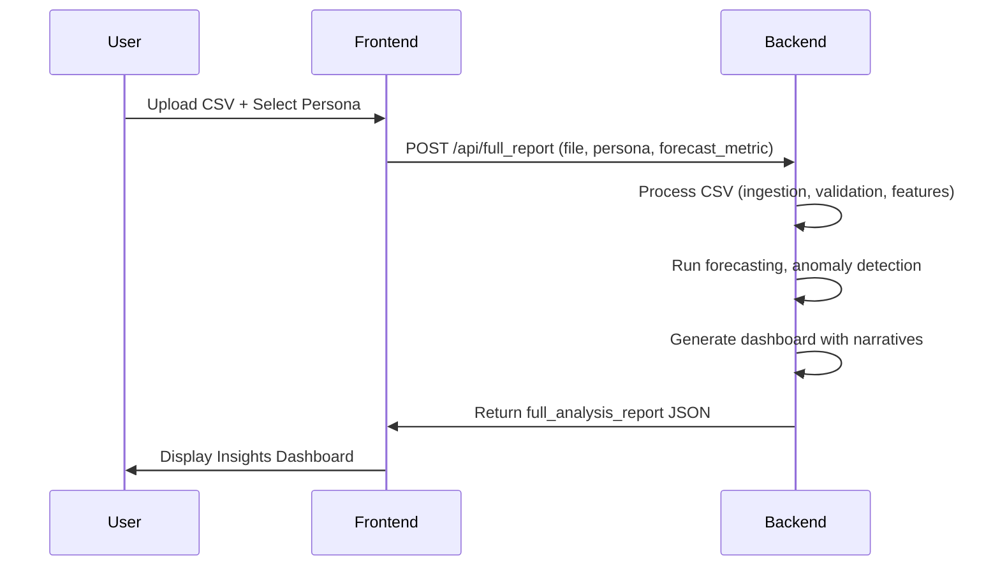
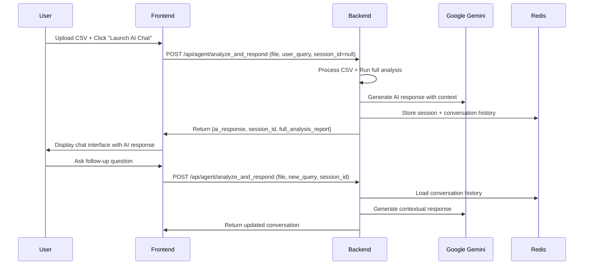
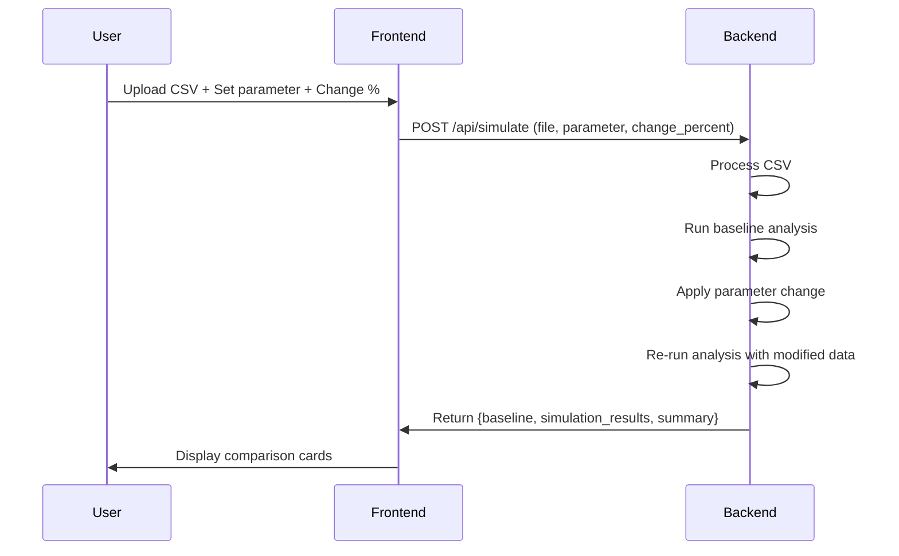

# 🔗 Frontend-Backend Integration Plan
**Praxify CFO - Complete System Integration**

**Date:** October 16, 2025  
**Status:** Analysis Complete - Ready for Integration

---

## 📋 Executive Summary

The repository contains two complete applications:
- **Backend**: Python FastAPI + Redis (AI/ML Financial Analysis Engine)
- **Frontend**: Next.js 15 + TypeScript (Modern React UI)

Both are production-ready but currently **NOT integrated**. This document provides a complete roadmap to connect them into a unified full-stack application.

---

## 🏗️ Current Architecture

```
┌─────────────────────────────────────────────────────┐
│         FRONTEND (Next.js - Port 3000)              │
│  ┌──────────┐  ┌──────────┐  ┌──────────┐         │
│  │  Upload  │  │ Insights │  │ AI Chat  │         │
│  └────┬─────┘  └────┬─────┘  └────┬─────┘         │
│       │            │            │                   │
│       └────────────┴────────────┘                   │
│              │                                       │
│          fetch('/api/...')  ❌ BROKEN               │
└──────────────┼──────────────────────────────────────┘
               │
               ✗ No connection
               │
┌──────────────▼──────────────────────────────────────┐
│      BACKEND (FastAPI - Port 8000)                  │
│  ┌────────────────────────────────────────────┐    │
│  │ Endpoints:                                  │    │
│  │  POST /api/full_report                     │    │
│  │  POST /api/agent/analyze_and_respond       │    │
│  │  POST /api/simulate                        │    │
│  └────────────────────────────────────────────┘    │
│              │                                       │
│        ┌─────▼─────┐                                │
│        │   Redis   │                                │
│        └───────────┘                                │
└─────────────────────────────────────────────────────┘
```

---

## 🚨 Critical Issues to Fix

### 1. **API Endpoint URL Mismatch** ⚠️ HIGH PRIORITY

**Problem:**
- Frontend calls: `fetch('/api/full_report')` (relative path)
- Backend serves: `http://localhost:8000/api/full_report`
- Result: 404 Not Found errors

**Locations:**
- `praxify-frontend/app/upload/page.tsx:65`
- `praxify-frontend/app/chat/page.tsx:54`
- `praxify-frontend/app/simulate/page.tsx:80`
- `praxify-frontend/app/insights/page.tsx:35`

**Solution Options:**

**Option A: Use Environment Variable (Recommended for Development)**
```typescript
// praxify-frontend/.env.local
NEXT_PUBLIC_API_URL=http://localhost:8000

// Update all fetch calls to:
fetch(`${process.env.NEXT_PUBLIC_API_URL}/api/full_report`)
```

**Option B: Create Next.js API Route Proxies (Production Ready)**
```typescript
// praxify-frontend/app/api/full_report/route.ts
export async function POST(request: Request) {
  const formData = await request.formData();
  const response = await fetch('http://backend:8000/api/full_report', {
    method: 'POST',
    body: formData,
  });
  return response;
}
```

---

### 2. **CORS Configuration Missing** ⚠️ HIGH PRIORITY

**Problem:**
- Browser blocks requests from `localhost:3000` to `localhost:8000`
- FastAPI has no CORS middleware configured

**Location:** `aiml_engine/api/app.py`

**Solution:**
```python
from fastapi.middleware.cors import CORSMiddleware

app = FastAPI(title="Agentic CFO Copilot API", version="1.0.0")

# Add CORS middleware
app.add_middleware(
    CORSMiddleware,
    allow_origins=[
        "http://localhost:3000",  # Next.js dev server
        "http://127.0.0.1:3000",
        # Add production domain later
    ],
    allow_credentials=True,
    allow_methods=["*"],
    allow_headers=["*"],
)
```

---

### 3. **API Response Field Mismatches** ⚠️ MEDIUM PRIORITY

**Problem A: Chat Response Field**
```typescript
// Frontend expects (app/chat/page.tsx:66, app/mvp/ai-agent/page.tsx:128):
const assistantMessage = data.response || data.answer || 'Error';

// Backend returns (endpoints.py:213):
"ai_response": ai_response_text
```

**Solution:** Update backend to include `response` field:
```python
final_response_data = {
    "response": ai_response_text,  # Add this
    "ai_response": ai_response_text,  # Keep for backward compatibility
    "full_analysis_report": full_analysis,
    "session_id": session_id,
    "conversation_history": history
}
```

**Problem B: Full Report Parameter Name**
```typescript
// Frontend sends (app/upload/page.tsx:62):
formData.append('persona', persona);  // 'finance_guardian'

// Backend expects (endpoints.py:78):
mode: str = Form("finance_guardian", ...)
```

**Solution:** Update backend to accept `persona`:
```python
@router.post("/full_report")
async def get_full_financial_report(
    file: UploadFile = File(...),
    persona: str = Form("finance_guardian", ...),  # Changed from 'mode'
    forecast_metric: str = Form("revenue", ...)
):
    # Update internal usage
    dashboard_output = dashboard_module.generate_dashboard(
        featured_df=featured_df, 
        forecast=forecast, 
        anomalies=anomalies, 
        mode=persona,  # Pass persona to mode
        correlation_report=correlation_report
    )
```

**Problem C: Simulation Parameter Name**
```typescript
// Frontend sends (app/simulate/page.tsx:85):
formData.append('change_percent', change.toString());

// Backend expects (endpoints.py:128):
change_pct: float = Form(...)
```

**Solution:** Update backend parameter name:
```python
@router.post("/simulate")
async def simulate_scenario_endpoint(
    file: UploadFile = File(...),
    parameter: str = Form(...),
    change_percent: float = Form(...),  # Changed from 'change_pct'
):
    simulation_report = simulation_module.simulate_scenario(
        df=featured_df, 
        parameter=parameter, 
        change_pct=change_percent  # Internal still uses change_pct
    )
```

---

### 4. **TypeScript Type Mismatches** ⚠️ MEDIUM PRIORITY

**Problem A: Forecast Chart Structure**

Frontend expects:
```typescript
interface ForecastChart {
  dates: string[];
  actual: number[];
  forecast: number[];
}
```

Backend returns (based on `dashboard.py` and JSON test files):
```json
{
  "forecast_chart": [
    {"date": "2025-01-01", "predicted": 500000, "lower_bound": 450000, "upper_bound": 550000},
    {"date": "2025-02-01", "predicted": 520000, "lower_bound": 470000, "upper_bound": 570000}
  ]
}
```

**Solution:** Update backend to match frontend expectations:
```python
# In dashboard.py, modify forecast chart generation
forecast_chart = {
    "dates": [point["date"] for point in forecast],
    "actual": [point.get("actual", 0) for point in forecast],  # If available
    "forecast": [point["predicted"] for point in forecast],
    "lower_bound": [point["lower_bound"] for point in forecast],
    "upper_bound": [point["upper_bound"] for point in forecast]
}
```

**Problem B: Conversation History Format**

Frontend expects:
```typescript
interface ChatMessage {
  role: 'user' | 'assistant';
  content: string;
  timestamp: string;
}
```

Backend returns from Redis memory - need to verify format matches.

---

### 5. **Environment Configuration** ⚠️ MEDIUM PRIORITY

**Current State:**
- Backend: `.env.example` exists, but `.env` not in repo
- Frontend: No environment file

**Required Files:**

**Backend `.env`:**
```bash
# Redis Configuration
REDIS_HOST=localhost  # or 'redis' in Docker
REDIS_PORT=6379

# API Configuration
API_PORT=8000
CORS_ORIGINS=http://localhost:3000,http://127.0.0.1:3000

# Google Gemini API
GOOGLE_API_KEY=your_actual_api_key_here
```

**Frontend `.env.local`:**
```bash
# Backend API URL
NEXT_PUBLIC_API_URL=http://localhost:8000

# Optional: Google Gemini API (if calling directly)
# GOOGLE_GEMINI_API_KEY=your_api_key_here
```

---

### 6. **Docker Compose Integration** ⚠️ LOW PRIORITY (For Production)

**Current `docker-compose.yml` only has backend services.**

**Updated docker-compose.yml:**
```yaml
version: '3.8'

services:
  redis:
    image: redis:7-alpine
    ports:
      - "6380:6379"
    volumes:
      - redis-data:/data
    healthcheck:
      test: ["CMD", "redis-cli", "ping"]
      interval: 10s
      timeout: 5s
      retries: 5
    networks:
      - praxify-network

  backend:
    build:
      context: .
      dockerfile: Dockerfile
    ports:
      - "8000:8000"
    environment:
      - REDIS_HOST=redis
      - REDIS_PORT=6379
      - GOOGLE_API_KEY=${GOOGLE_API_KEY}
      - CORS_ORIGINS=http://localhost:3000,http://frontend:3000
    depends_on:
      redis:
        condition: service_healthy
    networks:
      - praxify-network
    volumes:
      - ./aiml_engine:/app/aiml_engine  # For development hot reload
      
  frontend:
    build:
      context: ./praxify-frontend
      dockerfile: Dockerfile  # Need to create this
    ports:
      - "3000:3000"
    environment:
      - NEXT_PUBLIC_API_URL=http://backend:8000
    depends_on:
      - backend
    networks:
      - praxify-network
    volumes:
      - ./praxify-frontend:/app  # For development hot reload
      - /app/node_modules
      - /app/.next

networks:
  praxify-network:
    driver: bridge

volumes:
  redis-data:
```

**Frontend Dockerfile needed:**
```dockerfile
# praxify-frontend/Dockerfile
FROM node:20-alpine

WORKDIR /app

# Install pnpm
RUN npm install -g pnpm

# Copy package files
COPY package.json pnpm-lock.yaml ./

# Install dependencies
RUN pnpm install --frozen-lockfile

# Copy source code
COPY . .

# Build the app (for production)
# RUN pnpm build

# Expose port
EXPOSE 3000

# Start development server
CMD ["pnpm", "dev"]

# For production, use:
# CMD ["pnpm", "start"]
```

---

## 📝 Implementation Checklist

### Phase 1: Quick Local Development Setup (1-2 hours)

- [ ] **1.1** Create `backend/.env` with Redis and CORS configuration
- [ ] **1.2** Add CORS middleware to `aiml_engine/api/app.py`
- [ ] **1.3** Create `praxify-frontend/.env.local` with API URL
- [ ] **1.4** Update all frontend fetch calls to use `NEXT_PUBLIC_API_URL`
- [ ] **1.5** Start Redis: `docker run -p 6379:6379 redis:7-alpine`
- [ ] **1.6** Start backend: `cd /path/to/praxify-CFO && python -m uvicorn aiml_engine.main:app --reload`
- [ ] **1.7** Start frontend: `cd praxify-frontend && pnpm install && pnpm dev`
- [ ] **1.8** Test basic upload and report generation

### Phase 2: API Alignment (2-3 hours)

- [ ] **2.1** Update backend `/full_report` to accept `persona` instead of `mode`
- [ ] **2.2** Update backend `/simulate` to accept `change_percent` instead of `change_pct`
- [ ] **2.3** Update backend chat response to include `response` field
- [ ] **2.4** Fix forecast_chart structure in `dashboard.py`
- [ ] **2.5** Test all three workflows: static report, AI chat, simulation

### Phase 3: TypeScript & Data Model Fixes (1-2 hours)

- [ ] **3.1** Update `praxify-frontend/lib/types.ts` to match actual backend responses
- [ ] **3.2** Fix forecast chart data transformation in frontend components
- [ ] **3.3** Verify conversation history format
- [ ] **3.4** Test edge cases (missing data, errors, etc.)

### Phase 4: Docker Integration (2-3 hours)

- [ ] **4.1** Create `praxify-frontend/Dockerfile`
- [ ] **4.2** Update `docker-compose.yml` with frontend service
- [ ] **4.3** Create `docker-compose.dev.yml` for development
- [ ] **4.4** Test full Docker stack deployment
- [ ] **4.5** Update GitHub Actions CI/CD for frontend builds

### Phase 5: Documentation & Polish (1 hour)

- [ ] **5.1** Create `INTEGRATION_QUICKSTART.md`
- [ ] **5.2** Update main `README.md` with full-stack setup
- [ ] **5.3** Document environment variables
- [ ] **5.4** Add troubleshooting guide

---

## 🎯 Quick Start Commands (After Integration)

### Development Mode (Local)

```bash
# Terminal 1: Start Redis
docker run -p 6379:6379 redis:7-alpine

# Terminal 2: Start Backend
cd /home/draxxy/praxify-CFO
source .venv/bin/activate  # If using venv
python -m uvicorn aiml_engine.main:app --reload --port 8000

# Terminal 3: Start Frontend
cd /home/draxxy/praxify-CFO/praxify-frontend
pnpm install  # First time only
pnpm dev
```

Open: http://localhost:3000

### Docker Mode (Full Stack)

```bash
cd /home/draxxy/praxify-CFO
docker-compose up --build
```

Open: http://localhost:3000

---

## 🔍 API Endpoint Mapping

| Frontend Route | Frontend Calls | Backend Endpoint | Status |
|---|---|---|---|
| `/upload` → "Generate Report" | `POST /api/full_report` | `POST /api/full_report` | ✅ Exists |
| `/upload` → "Launch AI Chat" | `POST /api/agent/analyze_and_respond` | `POST /api/agent/analyze_and_respond` | ✅ Exists |
| `/chat` → Send message | `POST /api/agent/analyze_and_respond` | `POST /api/agent/analyze_and_respond` | ✅ Exists |
| `/insights` → "Switch to Chat" | `POST /api/agent/analyze_and_respond` | `POST /api/agent/analyze_and_respond` | ✅ Exists |
| `/simulate` → Run simulation | `POST /api/simulate` | `POST /api/simulate` | ✅ Exists |

**All endpoints exist** - just need parameter alignment and CORS!

---

## 📦 Data Flow Examples

### Workflow 1: Upload → Static Report



### Workflow 2: Upload → AI Chat



### Workflow 3: Scenario Simulation



---

## 🧪 Testing Plan

### Manual Testing Checklist

**Test 1: Static Report Generation**
- [ ] Upload `aiml_engine/data/sample_financial_data.csv`
- [ ] Select "Finance Guardian" persona
- [ ] Select "Revenue" forecast metric
- [ ] Click "Generate Static Report"
- [ ] Verify redirect to `/insights`
- [ ] Verify KPIs display correctly
- [ ] Verify forecast chart renders
- [ ] Verify anomalies table (if any)
- [ ] Verify narratives display

**Test 2: AI Chat Session**
- [ ] Upload CSV
- [ ] Click "Launch AI Chat"
- [ ] Verify initial AI response
- [ ] Ask: "What's my biggest expense?"
- [ ] Verify AI responds with context
- [ ] Ask: "How can I improve profit margin?"
- [ ] Verify conversation history maintained
- [ ] Check Redis for session data

**Test 3: Scenario Simulation**
- [ ] Upload CSV
- [ ] Set parameter: "expenses"
- [ ] Set change: "-10"
- [ ] Click "Run Simulation"
- [ ] Verify baseline metrics
- [ ] Verify simulated metrics
- [ ] Verify percentage changes
- [ ] Verify summary text

**Test 4: Error Handling**
- [ ] Upload invalid file format
- [ ] Upload empty CSV
- [ ] Try chat without uploading file
- [ ] Test with Redis offline
- [ ] Test with invalid GOOGLE_API_KEY

---

## 🐛 Known Issues & Workarounds

### Issue 1: GOOGLE_API_KEY Not Set
**Symptom:** AI responses show "I'm sorry, I encountered an error"
**Solution:** Set valid Gemini API key in backend `.env`

### Issue 2: Redis Connection Failed
**Symptom:** Chat sessions don't persist
**Solution:** Ensure Redis is running on correct port

### Issue 3: File Upload Size Limits
**Symptom:** Large CSV files fail to upload
**Solution:** 
- Next.js: Update `next.config.ts` with `bodySizeLimit`
- Backend: Already set to 100MB in nginx.conf

### Issue 4: CORS Preflight Failures
**Symptom:** Browser console shows OPTIONS requests failing
**Solution:** Ensure CORS middleware allows OPTIONS method

---

## 📈 Performance Considerations

1. **File Processing Time**: Large CSVs (>10MB) may take 10-30 seconds
   - Consider adding progress indicators in frontend
   - Consider chunked processing for very large files

2. **AI Response Latency**: Gemini API calls take 2-5 seconds
   - Show loading spinner
   - Consider streaming responses in future

3. **Redis Memory**: Conversation history grows over time
   - Consider TTL on sessions (e.g., 7 days)
   - Consider pagination for long conversations

4. **Frontend Build Size**: Rich UI components add weight
   - Already using dynamic imports
   - Consider code splitting by route

---

## 🔐 Security Considerations

1. **API Key Exposure**
   - ✅ Backend stores GOOGLE_API_KEY in .env (not in code)
   - ✅ Frontend doesn't need direct API key access
   - ⚠️ Don't commit .env files to git

2. **File Upload Validation**
   - ✅ Backend validates CSV format
   - ✅ File size limits enforced
   - ⚠️ Consider virus scanning for production

3. **CORS Configuration**
   - ✅ Whitelist specific origins
   - ⚠️ Don't use `allow_origins=["*"]` in production

4. **Session Management**
   - ✅ Redis-backed sessions
   - ⚠️ Consider adding authentication in production
   - ⚠️ Consider encrypting session data

---

## 🚀 Next Steps

1. **Immediate (Do First)**
   - Add CORS to backend
   - Create environment files
   - Update API URLs in frontend
   - Test basic upload → report workflow

2. **Short Term (This Week)**
   - Fix parameter name mismatches
   - Fix response field mismatches
   - Update TypeScript types
   - Test all three workflows end-to-end

3. **Medium Term (Next Sprint)**
   - Create frontend Dockerfile
   - Update docker-compose for full stack
   - Add GitHub Actions for frontend
   - Deploy to staging environment

4. **Long Term (Future Enhancements)**
   - Add authentication/authorization
   - Add user accounts and multi-tenancy
   - Add data persistence (PostgreSQL)
   - Add real-time notifications (WebSockets)
   - Add collaborative features

---

## 📞 Support & Resources

- **Backend API Docs**: http://localhost:8000/docs (when running)
- **Frontend Dev Server**: http://localhost:3000
- **Redis Commander**: `docker run -p 8081:8081 rediscommander/redis-commander`
- **Test Data**: `aiml_engine/data/sample_financial_data.csv`

---

**Ready to integrate? Start with Phase 1! 🎉**
